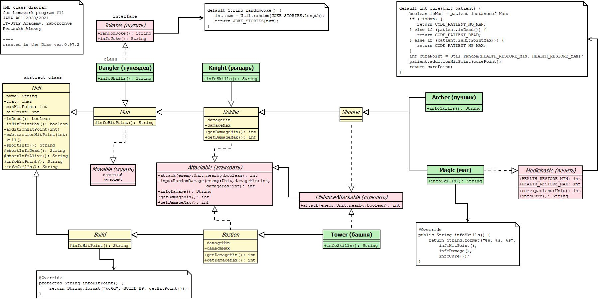
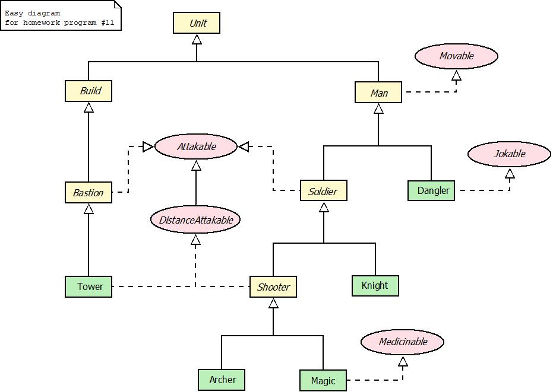
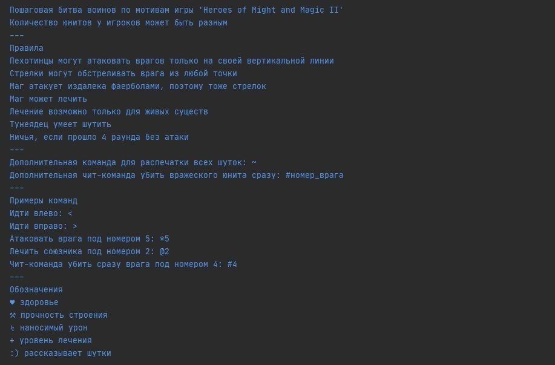

Step-by-step battle for java console
----
Lesson theme:
- abstract class
- extends classes
- interface

Features of the program code:
- using null in return values (breaking GoF patterns)
- using error codes in return values instead of exceptions (exceptions will be studied later)

---------

---------

---------

[09.03.21]